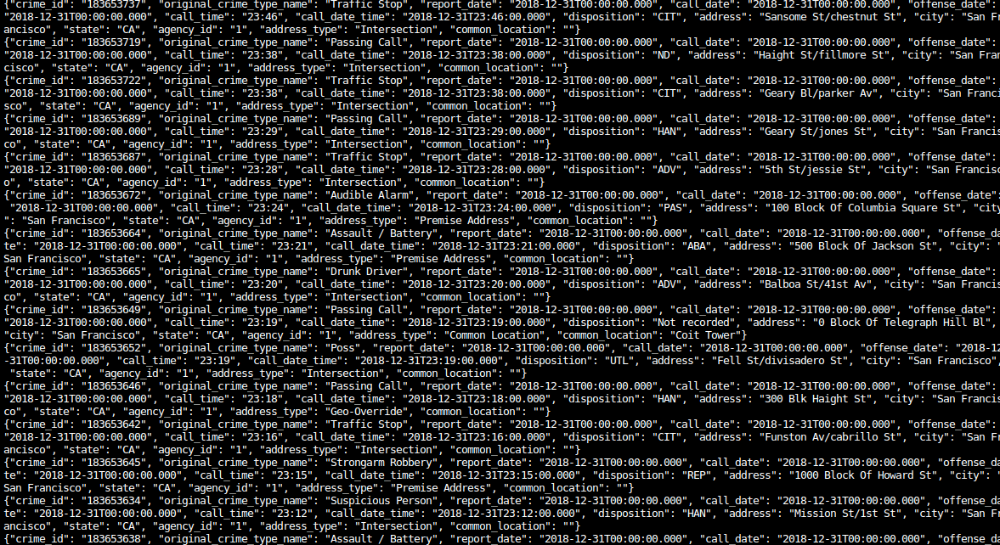
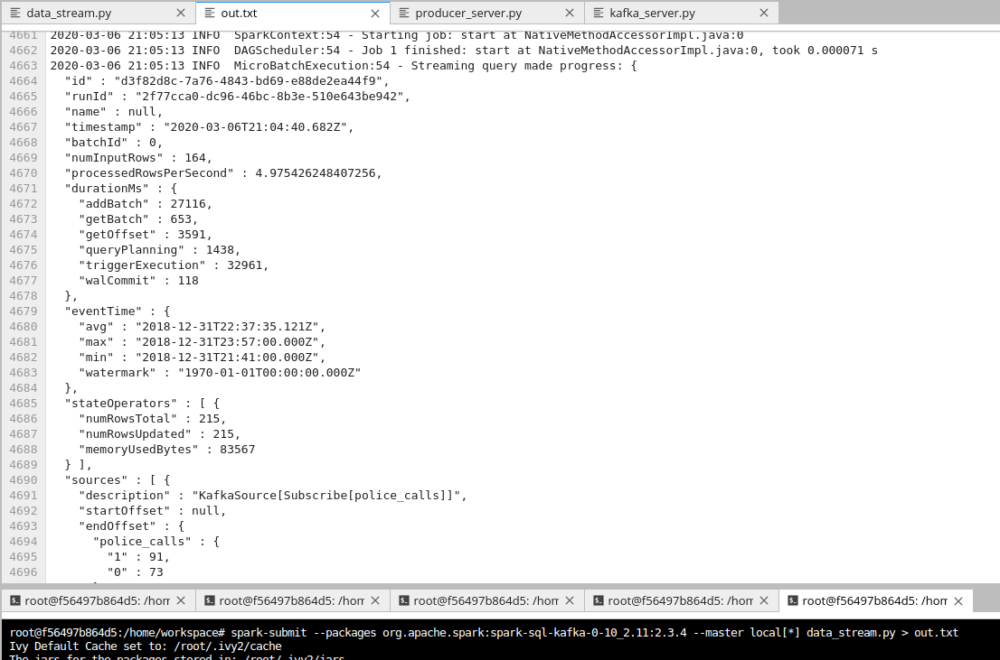
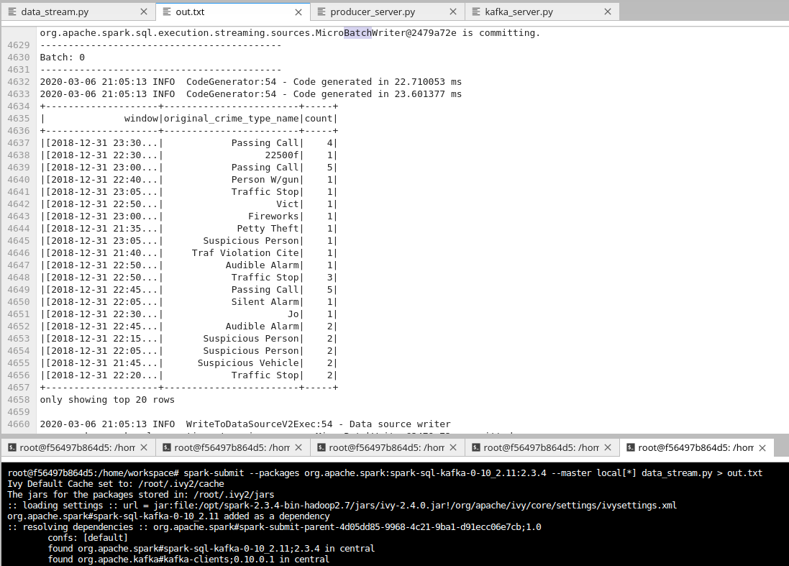

# SF Crime Statistics with Spark Streaming Project

## Introduction 

The aim of the project is to create an Streaming application with Spark that connects to a 
Kafka cluster, reads and process the data.

## Requirements

* Java 1.8.x
* Scala 2.11.x
* Spark 2.4.x
* Kafka
* Python 3.6 or above

## How to use the application

In order to run the application you will need to start:

1. Zookeeper:

`/usr/bin/zookeeper-server-start config/zookeeper.properties`

2. Kafka server:

`/usr/bin/kafka-server-start config/server.properties`

3. Insert data into topic:

`python kafka_server.py`

4. Kafka consumer:

`kafka-console-consumer --topic "topic-name" --from-beginning --bootstrap-server localhost:9092`

5. Run Spark job:

`spark-submit --packages org.apache.spark:spark-sql-kafka-0-10_2.11:2.3.4 --master local[*] data_stream.py`

### Kafka Consumer Console Output

### Progress Reporter

### Count Output

Answers to Udacity's Questions :

1. How did changing values on the SparkSession property parameters affect the throughput and latency of the data?

    spark.executor.memory : setting executor memory 
    spark.executor.cores : setting executor cores
    spark.driver.memory : setting driver memory
    numInputRecords : The number of records processed in a trigger
    inputRowsPerSecond : The rate of data arriving
    processedRowsPerSecond : The rate at which Spark is processing data
    

2. What were the 2-3 most efficient SparkSession property key/value pairs? Through testing multiple variations on values, how can you tell these were the most optimal? 

    spark.default.parallelism : 3
    spark.streaming.kafka.maxRatePerPartition : 10